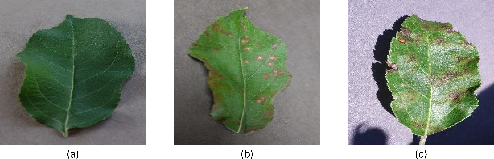
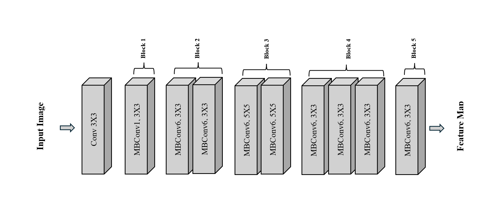

# TelU-Tubes-TugasAkhir-KlasifikasiPenyakitTanamanApel

## Deskripsi Proyek
Proyek ini bertujuan untuk membangun sebuah sistem klasifikasi penyakit tanaman apel menggunakan teknologi pembelajaran mesin (machine learning). Sistem ini dirancang untuk membantu petani atau agronom dalam mendiagnosis penyakit tanaman apel berdasarkan citra daun tanaman.

Dengan menggunakan dataset citra daun tanaman apel, model pembelajaran mesin akan dilatih untuk mengenali berbagai jenis penyakit tanaman apel, seperti:
- Apple Scab
- Cedar Apple Rust
- Healthy

Proyek ini merupakan repository dari paper [Classification of Apple Leaf Diseases Using a Modified EfficientNet](README/Paper_Classification_of_Apple_Leaf_Diseases_Using_a_Modified_EfficientNet.pdf) dan [Slide Presentasi](README/Presentation_Slide_Classification_of_Apple_Leaf_Diseases_Using_a_Modified_EfficientNet.pdf). Berikut adalah sertifikat [Pembicara](README/Certificate_Presenter.pdf) dan [Penulis](README/Certificate_Author.pdf)

## Fitur Utama
- **Preprocessing Data**: Melakukan augmentasi dan normalisasi pada dataset.
- **Model Klasifikasi**: Menggunakan algoritma deep learning yaitu EfficientNetV1.
- **Evaluasi Model**: 
    - Menyediakan metrik evaluasi seperti akurasi, presisi, recall, dan F1-score yang diuji ke dataset berbeda dari proses training.
    - Menyediakan K-Fold Cross Validation.
- **Kontribusi Penelitian**: Membuat Model yang Ringan Namun Dapat Mengeneralisasi Dengan Baik Dengan Cara Melakukan Modifikasi Terhadap Arsitektur EfficientNetV1.

## Dataset
Dataset yang digunakan dalam proyek ini adalah kumpulan citra daun apel yang teranotasi dengan label jenis penyakit atau kategori "sehat". Dataset ini dapat diperoleh dari sumber-sumber berikut [Plant Pathology Dataset](https://www.kaggle.com/code/tarunpaparaju/plant-pathology-2020-eda-models) dan [PlantVillage-Dataset](https://github.com/spMohanty/PlantVillage-Dataset).

Struktur dataset:
```
dataset/
├── train/
│   ├── Apple Scab/
│   ├── Cedar Apple Rust/
│   └── Healthy/
├── validation/
│   ├── Apple Scab/
│   ├── Cedar Apple Rust/
│   └── Healthy/
└── test/
    ├── Apple Scab/
    ├── Cedar Apple Rust/
    └── Healthy/
```

Contoh citra dalam dataset:
- **Apple Scab**: Daun dengan bercak hitam atau cokelat.
- **Cedar Apple Rust**: Daun dengan bintik-bintik oranye atau merah.
- **Healthy**: Daun yang bersih tanpa tanda penyakit.

Preview Plant Pathology Dataset


Preview Plant Pathology Dataset



## Arsitektur Model
Preview Arsitektur EfficientNetV1 yang Sudah Dimodifikasi



## Hasil Evaluasi
Hasil evaluasi model yang dilatih dengan k-Fold:

| Model              | Train Akurasi | Val Akurasi | Test Akurasi | Precision | Recall | F1-Score |
|--------------------|-------------|-------------|------------|--------------|------------|--------------|
| Mean    | 0.978        | 0.967       | 0.820       | 0.799        | 0.607 | 0.598|
| Std         | 0.004       | 0.0012        | 0.046      | 0.059         |0.083 | 0.101|

Informasi lebih lengkap dapat dilihat didalam paper [Classification of Apple Leaf Diseases Using a Modified EfficientNet](README/Paper_Classification_of_Apple_Leaf_Diseases_Using_a_Modified_EfficientNet.pdf).


## Prasyarat
1. **Python** (versi 3.8 atau lebih baru)
2. **Library Python**:
   - TensorFlow / PyTorch
   - scikit-learn
   - NumPy
   - pandas
   - Matplotlib
   - Dll
3. **Jupyter Notebook** (opsional, dapat menggunakan VSCODE dan semacamnya)

## Cara Penggunaan
1. **Clone repositori ini:**
   ```bash
   git clone https://github.com/AbiyaMakruf/TelU-Tubes-TugasAkhir-KlasifikasiPenyakitTanamanApel.git
   cd TelU-Tubes-TugasAkhir-KlasifikasiPenyakitTanamanApel
   ```

2. **Instal dependensi:**
   ```bash
   pip install -r utils/requirements.txt
   ```

3. **Jalankan projek:**
    ```bash
    buka notebook.ipynb
   ```

## Script create key for SSH
1. **Buat ssh-keygen:**
   ```bash
    ssh-keygen -t rsa -b 4096 -C "aabbiiyyaa@gmail.com"
   ```

2. **Tampilkan key pub dan masukkan kedalam ssh github:**
   ```bash
   cat ~/.ssh/id_rsa.pub
   ```

3. **Cek koneksi ke github:**
    ```bash
    ssh -T git@github.com
    ```

## Kontribusi
Kontribusi sangat diterima! Jika Anda ingin membantu proyek ini, silakan:
1. Fork repositori ini.
2. Buat branch baru untuk fitur atau perbaikan Anda.
3. Kirim pull request ke branch utama.

## Referensi Dari Openlibrary Telkom University
- https://openlibrary.telkomuniversity.ac.id/home/catalog/id/217314/slug/klasifikasi-penyakit-citra-daun-pada-tanaman-anggur-berbasis-machine-learning-dalam-bentuk-buku-karya-ilmiah.html
- https://openlibrary.telkomuniversity.ac.id/home/catalog/id/215210/slug/klasifikasi-penyakit-tanaman-menggunakan-convolutional-neural-network-cnn-dan-pemantauan-pertumbuhan-tanaman-cabai-dalam-bentuk-buku-karya-ilmiah.html

## Kontak
Jika Anda memiliki pertanyaan atau saran, silakan hubungi:
- **Nama**: Abiya Makruf
- **Email**: [aabbiiyyaa@gmail.com](mailto:aabbiiyyaa@gmail.com)
- **GitHub**: [AbiyaMakruf](https://github.com/AbiyaMakruf)

## Some Tips
- Jika precision tinggi tetapi recall rendah, sistem hanya mendeteksi penyakit daun apel seperti Apple Scab saat sangat yakin, tetapi beberapa daun yang sebenarnya terkena penyakit mungkin tidak terdeteksi.
- Jika recall tinggi tetapi precision rendah, sistem menangkap hampir semua daun yang terkena penyakit seperti Black Rot, tetapi mungkin menghasilkan banyak deteksi palsu pada daun yang sebenarnya sehat.
- F1-score yang tinggi menunjukkan sistem yang seimbang dalam ketepatan dan sensitivitas, cocok untuk klasifikasi penyakit daun apel yang membutuhkan keseimbangan.

---

Terima kasih telah mengunjungi proyek ini! Semoga bermanfaat bagi Anda.

